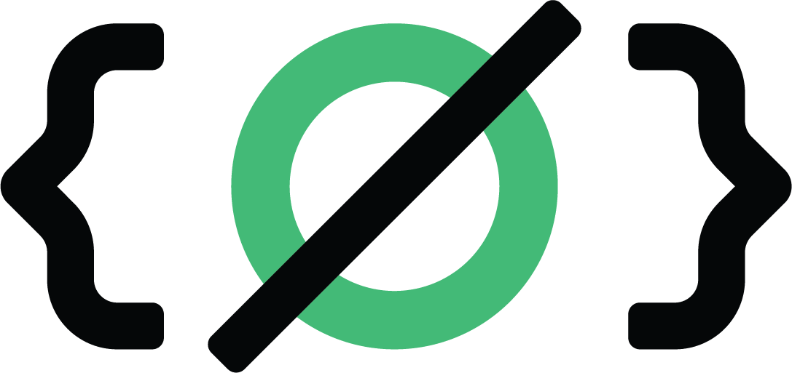

# <chat.io/>
Una prueba de concepto para armar un chat con Vue y Socket.io

### TO-DOs

* [x]  Fix para que no puedas poner enter solo
* [x]  Voy a tener que dar vuelta el chat para que lo mas nuevo quede priemro
* [x]  Fix de que los perfiles online no se pisen
* [ ]  Un scroll o overflow hidden o borrar lo mas viejo.
* [ ]  Que el chat pueda mantener session via cookie o LS
* [ ]  Mantener el chat historico mientras haya alguien online
* [ ]  Marcar in-chat cuando alguien se loguea
* [ ]  Una parte para personalizar el chat y/o el perfil
* [ ]  Documentacion (?)

### Tecnologias usada

- **[Vue.js](https://vuejs.org/)**
- **[Socket.io](https://socket.io/)**
- **[Tailwind CSS](https://tailwindcss.com/)**
- **[Node](https://nodejs.org/en/)**
- **[Express](https://expressjs.com/)**
- **[Git](https://git-scm.com/)**
- **[Github](https://github.com/)**
- **[Conectemos (Plesk)](https://conectemos.com/)**

<!-- 

 -->

<!-- ### Docs

Laravel is a web application framework with expressive, elegant syntax. We believe development must be an enjoyable and creative experience to be truly fulfilling. Laravel takes the pain out of development by easing common tasks used in many web projects, such as:

- [Simple, fast routing engine](https://laravel.com/docs/routing).
- [Powerful dependency injection container](https://laravel.com/docs/container).
- Multiple back-ends for [session](https://laravel.com/docs/session) and [cache](https://laravel.com/docs/cache) storage.
- Expressive, intuitive [database ORM](https://laravel.com/docs/eloquent).
- Database agnostic [schema migrations](https://laravel.com/docs/migrations).
- [Robust background job processing](https://laravel.com/docs/queues).
- [Real-time event broadcasting](https://laravel.com/docs/broadcasting). -->

#### Contacto

<!-- ## License

The Laravel framework is open-sourced software licensed under the [MIT license](https://opensource.org/licenses/MIT). -->
